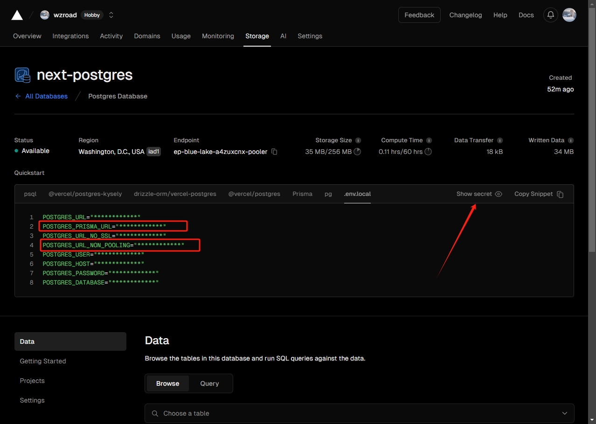

# Puppetter Douban

每周一凌晨 1 点定时获取豆瓣热门电影数据。

> 该项目仅用与学习交流，不用于任何商业用途。

## 本地运行

本地运行请确保已经安装了 Postgres！

在根目录下新建`.env`文件，将根目录下`env.example`文件中的变量复制到`.env`文件中，并补充上正确的值。

一般情况下， `POSTGRES_PRISMA_URL` 和 `POSTGRES_URL_NON_POOLING` 设为同一个值即可。

> 如果需要使用其它数据库，或者不清楚如何设置，请看[这篇文章](https://www.prisma.io/docs/orm/reference/connection-urls)。

本项目使用的是[vercel](https://vercel.com/)创建的免费 Postgres 数据库，如果你不想自己下载数据库，可以注册 Vercel 账号，并创建一个 Postgres 数据库，它直接提供了 prisma 的配置，直接复制就可以了。



```bash
npm install
```
